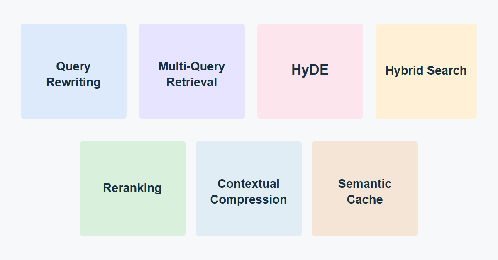

# productionRAG

My hands-on learning repository for Retrieval-Augmented Generation (RAG) techniques.

This is a notebook-first space where I implement and understand techniques that go beyond a basic retrieve-and-generate flow. Each notebook focuses on one method and the trade-offs behind it.



## What is implemented

| Area | Technique | What it improves |
| --- | --- | --- |
| Baseline | Simple vector RAG | A clean reference pipeline for comparison |
| Query understanding | Query rewriting | Turns conversational follow-ups into standalone search queries |
| Query understanding | Multi-query retrieval | Broadens recall by searching multiple query perspectives |
| Query understanding | HyDE | Retrieves against a hypothetical answer when the question is sparse |
| Retrieval | Hybrid search | Combines lexical BM25 and dense semantic retrieval |
| Retrieval | Reranking | Promotes the most relevant candidates before generation |
| Context | Contextual compression | Removes irrelevant content before it reaches the model |
| Performance | Semantic cache | Reuses answers for semantically similar requests |

## Repository map

```text
productionRAG/
|- notebooks/                     # Runnable learning implementations
|  |- simple.ipynb                # Baseline vector RAG
|  |- query_rewriting.ipynb       # Conversational query rewriting
|  |- multiQuery.ipynb            # Multi-query retrieval
|  |- hyde_search.ipynb           # Hypothetical Document Embeddings
|  |- hybridSearch.ipynb          # Dense + lexical retrieval
|  |- reranking.ipynb             # Cross-encoder reranking
|  |- compressor.ipynb            # Contextual compression
|  |- semantic_cache.ipynb        # GPTCache-backed semantic cache
|  `- response_cache.ipynb        # Reserved for exact-response caching
|- assets/                        # Visuals for README and LinkedIn
|  |- production-rag-methods.png  # Post-ready image
|  `- production-rag-methods.svg  # Editable source image
|- docs/
|  |- architecture.md             
|- example.pdf                    # Example ingestion document
|- pyproject.toml                 # Project dependencies
`- uv.lock                        # Locked dependency versions
```

## Quick start

1. Install the locked environment with `uv sync`.
2. Add the provider credentials you use to `.env` (for example `PINECONE_API_KEY` and the model-provider key).
3. Open a notebook in `notebooks/` and select the project environment as the kernel.
4. Start with `simple.ipynb`, then explore one production method at a time.

The notebooks use a local embedding model, Pinecone for vector search, LangChain components, and Groq-compatible chat models. See [the architecture guide](docs/architecture.md) for how these methods can fit together.

